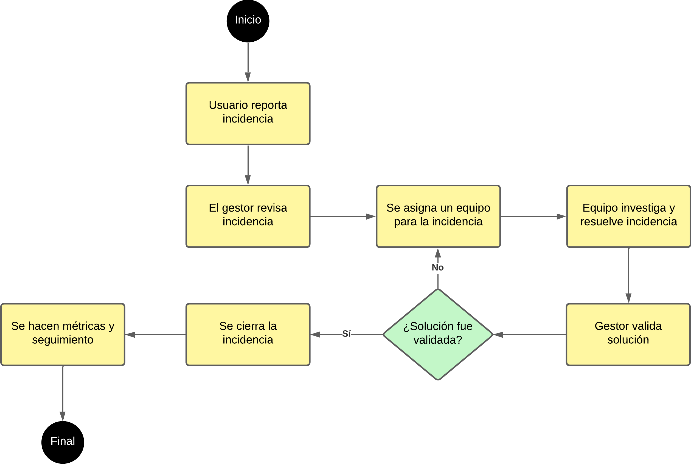

# SGI-Prototipo para la empresa AndesBank(Sistema de Gestión de Incidencias)

## Descripción
Este proyecto es un prototipo funcional en el lenguaje de Python para la gestión de reportes de incidencias en el entorno FinTech. Está diseñado para demostrar principios de ciclo de vida seguro, gestión de control de cambios y prácticas DevSecOps.


## Módulo funcional de Reportes de incidencias
- Registro, consulta y actualización de incidencias vía API REST.
- Incluye endpoints para creación, listado, consulta específica y modificación/cierre de incidencias.


## Proceso formal de control de cambios

1. Todo cambio parte de una incidencia registrada en el sistema.
2. Se realiza la modificación en una rama o directamente en main (según nivel de formalidad requerido).
3. Cada **commit** relacionado está documentado con el número de incidencia (ejemplo: `fix: corrige cierre de login (incidencia #4)`).
4. Se recomienda el uso de **pull requests** y revisión, aunque en el prototipo solo el desarrollador realiza los cambios.


## Flujo SDLC Seguro

### 1. **Diseño y codificación**
- El sistema se implementa bajo los principios de trazabilidad, control y documentación exigidos por ISO/IEC 12207 y ANSI EIA-649.
- Se emplean buenas prácticas: control de versiones Git, documentación de incidencias y cambios.

### 2. **Pruebas y validación**
- Los endpoints son probados manualmente via `curl` y/o Postman.
- Se realizan pruebas unitarias básicas sobre la lógica de la API.

### 3. **Control de seguridad (DevSecOps)**
- Se integra una herramienta SAST (la cuál será la herramienta Bandit, debido a que funciona para Python) para detectar vulnerabilidades durante el desarrollo.
- **Ejemplo de hallazgo:**  
  > Bandit reportó la presencia de `debug=True` en Flask, lo cual puede ser riesgoso en producción. Se usa solo en desarrollo local y se advierte no activar en un entorno real.
- Reporte de seguridad guardado en `reporte_seguridad.txt`.

### 4. **Despliegue responsable**
- El prototipo no debe ejecutarse con `debug=True` en producción.
- Se recomienda siempre auditar la seguridad antes de publicar actualizaciones.


## Instrucciones de uso

1. Clona el repositorio para tenerlo en local:
    ```
    git clone https://github.com/CarlosRom37/sgi-prototipo.git
    cd sgi-prototipo
    ```

2. Instala dependencias y ejecutar el programa:
    ```
    pip install flask
    python app.py
    ```

3. Prueba los endpoints:

    - Crear incidencia:
      ```
      curl -X POST http://localhost:5000/incidencias \
      -H "Content-Type: application/json" \
      -d "{\"titulo\": \"Fallo login\", \"descripcion\": \"No reconoce clave\", \"prioridad\": \"alta\"}"
      ```

    - Consultar todas:
      ```
      curl http://localhost:5000/incidencias
      ```

    - Consultar una específica:
      ```
      curl http://localhost:5000/incidencias/1
      ```

    - Actualizar/cerrar:
      ```
      curl -X PATCH http://localhost:5000/incidencias/1 \
      -H "Content-Type: application/json" \
      -d "{\"estado\": \"cerrada\", \"responsable\": \"Juan\"}"
      ```


## Seguridad y recomendaciones

- **Nunca** dejar el servidor Flask en producción con `debug=True`.
- Ejecutar Bandit regularmente para detectar vulnerabilidades.
- Documentar la relación entre incidencias y cambios de código (commit, ID).

## Diagrama de Procesos

A continuación, se presenta el diagrama de procesos que define el flujo de gestión de incidencias, desde el registro hasta el cierre y seguimiento, asegurando trazabilidad y control según las buenas prácticas y normas ISO/IEC 12207.


